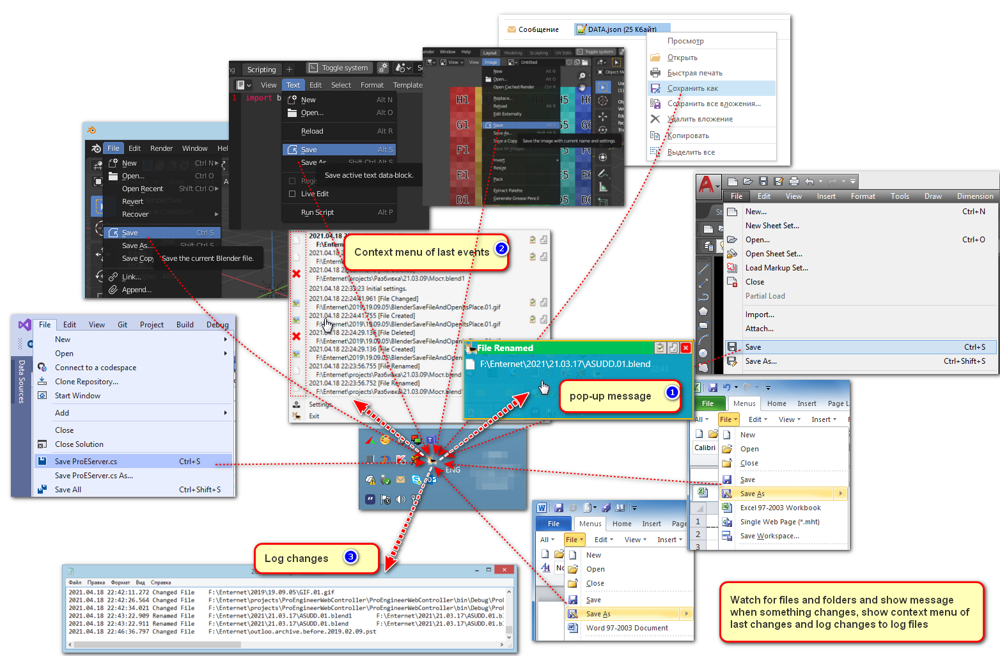
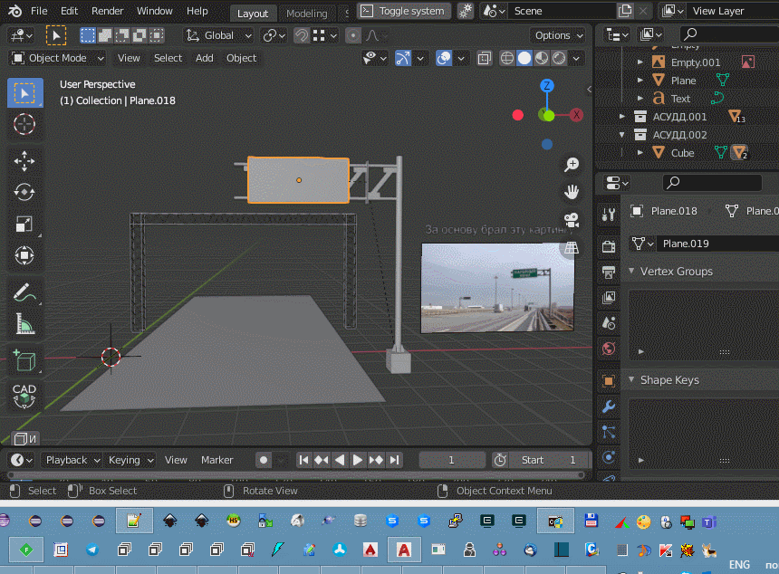
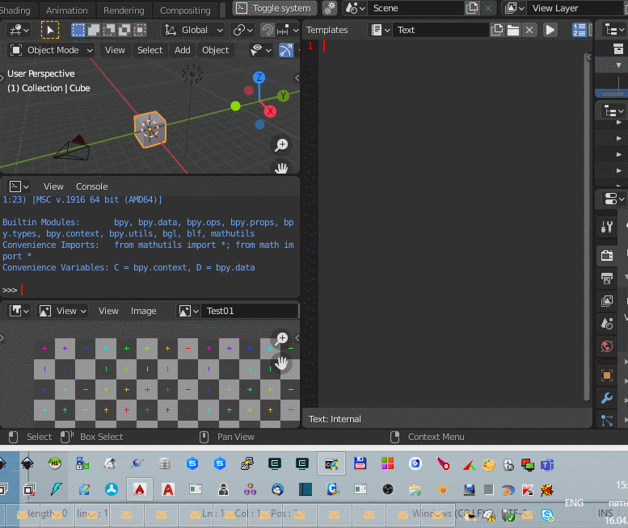
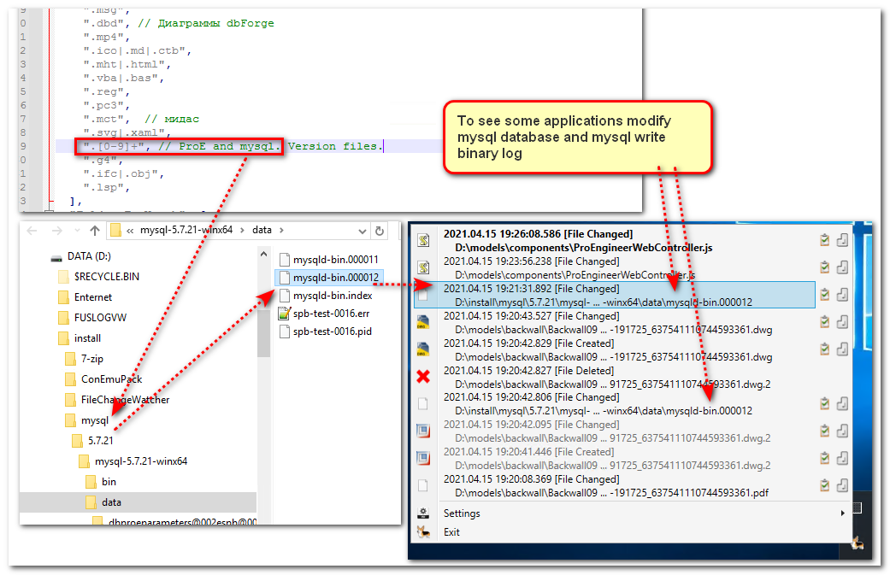
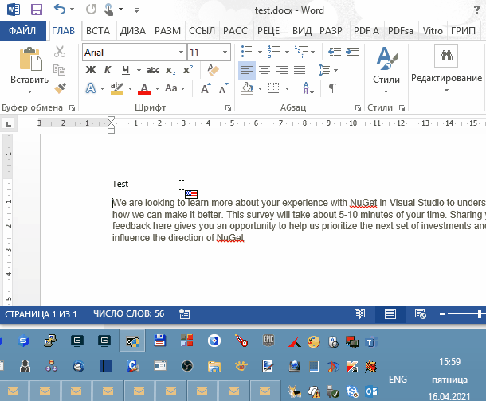
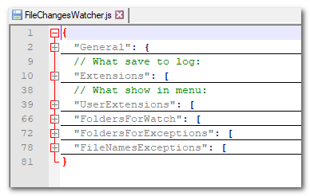
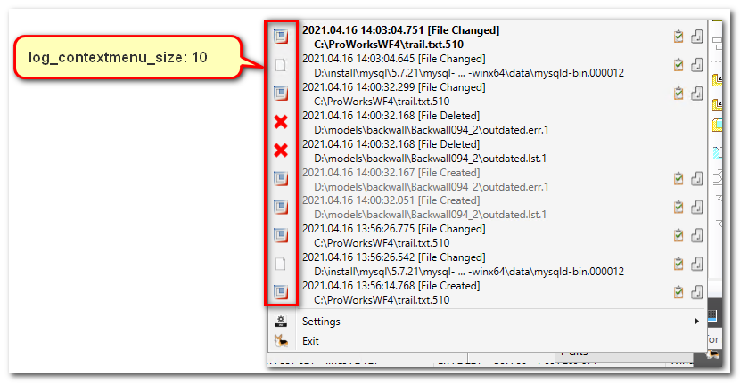
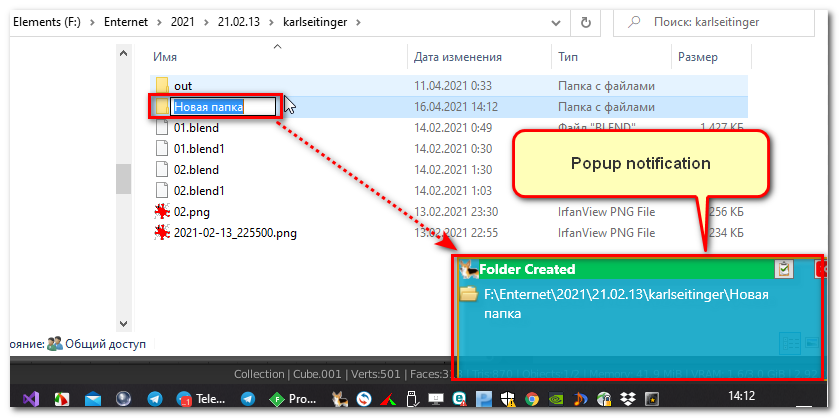
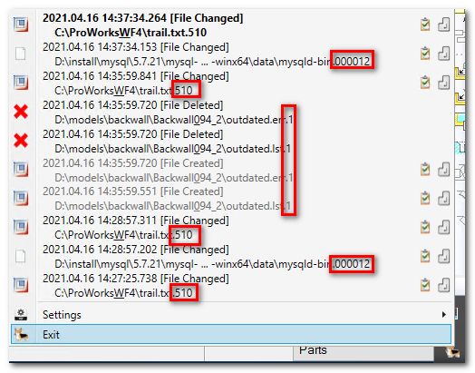
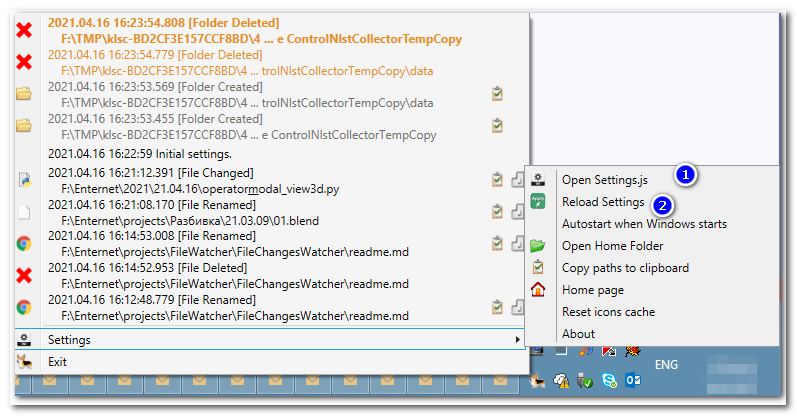

## Legacy Information

For DotNet 4.0 see branch dot_net_4.0

## Download

https://sourceforge.net/projects/filechangeswatcher/files/

No drivers, no spyware, no admin rights.

## Description

Pop-up messages on save files, copy files, remove files or folders



If you do not see popup then add extensions or paths to settings of this program.

This application for **Windows** XP/8/10 users only and it is just the user interface of WinAPI functions
System.IO.FileSystemEventHandler. See documentation about WinAPI functions:

https://docs.microsoft.com/en-us/dotnet/api/system.io.filesystemeventhandler?view=netframework-4.0

and

https://weblogs.asp.net/ashben/31773

The program has the tray icon. When user or program create files, change files, remove files  this application
shows the pop-up of event and you can click it to open windows explorer and select current file (if file exists).

## When to use it?

I use it when I want to know about different disk activities:

- Save file activity:



- Save Scripts and images activities:



- mysql activity to modify database:



- Save MS Word (MS Office) file activity:



And other events with create/change/remove files and folders.

## Settings

The program has settings in file "FileChangesWatcher.js". This file of json format has several sections:



If you do not have this file the program will create it with default settings.

#### General

```JSON
  "General": {
    "log_contextmenu_size": 10,
    "display_notifications": true,
    "log": true,
    "log_path": ".",
    "log_file_prefix": ""
  },
```

- **log_contextmenu_size**: 10 - How many items you will see in context menu of this program when you press the right mouse button on tray icon:



- **display_notifications**: true/false - Enable/disable pop-up notifications.



- **log**: true/false - writes all events to log file.
- **log_path**: "." | "D:/log" - Path to save log files. "." - write logs into folder where the program runs.
- **log_file_prefix**: "" - prefix for log files. This program always adds current date at the end of the log file name with format YYYY.MM.dd. 


#### UserExtensions

```JSON
  "UserExtensions": [
    {
      "extensions01": ".json"
    },
    {
      "officeword": ".doc|.docx|.docm|.dotx|.dotm|.rtf|.xls|.xlsx|.xlsm|.vsd|.vsdx",
      "visual_studio": ".csproj|.sln",
    },
    ".bmp|.gif|.jpg|.jpeg|.tiff|.tif|.js|.cs|.java|.exe|.dwg|.dxf|.rar",
    ".tar|.jar|.zip|.bzip2|.gz|.tgz|.7z|.rar|.pro|.dvb|.txt|.pdf|.png|.dll",
    ".msg",
    ".dbd", // Diagramm dbForge
    ".mp4",
    ".ico|.md|.ctb",
    ".mht|.html",
    ".vba|.bas",
    ".reg",
    ".pc3",
    ".mct",  // Midas
    ".svg|.xaml",
    ".[0-9]+", // ProE versions files
    ".g4",
    ".ifc|.obj",
    ".py",
    ".exe|.dll|.h|.c|.cpp",
    ".blend[0-9]*", // blender
    ".py",
  ],
```

In the context menu the program shows files with extensions user has chosen. Devider is '|'. 



#### Extensions

```JSON
"Extensions": [
    [{"archivers": ".tar|.jar|.zip|.bzip2|.gz|.tgz|.7z|.rar"}],
    {
      "office": ".xls|.xlt|.xlm|.xlsx|.xlsm|.xltx|.xltm|.xlsb|.xla|.xlam|.xll|.xlw|.ppt|.pot|.pptx|.pptm|.potx|.potm|.ppam|.ppsx|.ppsm|.sldx|.sldm|.vsd|.vsdx|.vdx|.vsx|.vtx|.vsl|.vsdm",
      "autodesk": ".dwg|.dxf|.dwf|.dwt|.dxb|.lsp|.dcl",
      "images": ".gif|.png|.jpeg|.jpg|.tiff|.tif|.bmp",
      "visual_studio": ".csproj|.sln|.vsix",
    },
    {
      "extensions03": ".cs|.xaml|.config|.ico",
    },
    {
      "extensions04": ".gitignore|.md",
    },
    {
      "extensions05": ".msg|.ini"
    },
    ".pdf|.html|.xhtml|.txt|.mp3|.aiff|.au|.midi|.wav|.pst|.xml|.java|.js|.php|.json|.exe|.html|.htm|.css|.csv|.dbd|.sql|.svg|.conf|.msi|.cptx|.mp4|.mp3|.flv|.dbf|.jsp|.rpm|.det|.dll",
	".pro",
	"trail.txt.[0-9]{2}",
	".dvb|.txt",
	".dbd", // diagrams dbForge
	".mp4|.ctb",
  ],
```

This is the list of file extensions the program logs for. Devider is '|'. When starts the program creates the regular
expression from this list. You can experiment with this format. See:

https://docs.microsoft.com/en-us/dotnet/api/system.text.regularexpressions.regex?view=net-5.0

http://regexstorm.net/tester

In this section JSON structure has no mean. The program reads only values. So you can create any hierarchy you want to classify extensions.

#### FileNamesExceptions

```JSON
  "FileNamesExceptions": [
    "~$"
  ]
```
The program doesn't watch for files with names begin with those symbols.

#### FoldersForWatch

```JSON
"FoldersForWatch": [
    {
      "folder01": "D:\\", // These values could be a string or an array of strings.
    },
    {"locals":["E:\\Docs", "F:\\", "T:\\", "C:\\Users", ]},
  ],
```

This is the list of folders and disks for watching. JSON structure in this setting has no means. Program read only values. So you can create any hierarchy you want to classify extensions.


#### FoldersForExceptions

```JSON
"FoldersForExceptions": [
    {
      "folder01": "D:\\temp"
    },
    "F:\\Enternet\\projects\\tender\\target"
  ],
```

If you want exclude some folders from watch so append them here. In this section JSON structure has no mean. The program reads only values. So you can create any hierarchy you want to classify extensions.

## Other



1. Open setting file.
2. Reload file settings.

## Author

email: **satabol@yandex.ru**