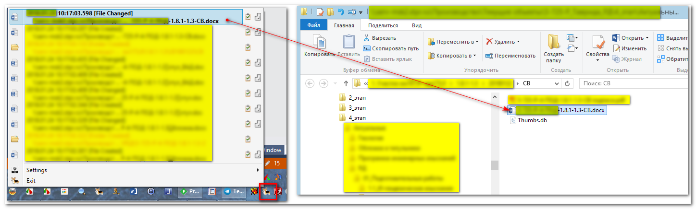

## Описание

Программа FileChangesWatcher предназначена для информирования пользователя о событиях изменения/создания/удаления/переименования файлов и событиях создания/удаления/переименования каталогов с помощью всплывающих сообщений над треем.

Присутствие программы отображается в трее следующим образом:

Программа имеет контекстное меню, в котором отображается список последних событий. Если событие произошло на существующем файле или
каталоге, то этот элемент контекстного меню можно выполнить и программа запустит проводник windows с выделением этого элемента в списке:

Тоже самое произойдёт, если вы нажмёте на всплывающее сообщение.

Программа не содержит в себе кода, читающего/анализирующего содержимое файлов или каталогов. 
Все данные для отображения программа получает в режиме readonly (за исключением записи в файлы логов), поэтому не оказывает воздействия на файлы или какую-либо другую информацию.

## О разработчике

Разработчик программы: **Захаров Александр Валерьевич**

email: **alex-zaharow@yandex.ru**

Пожелания можно отправлять на мой email с пометкой в теме "FileChangesWatcher,version:vvvvvvv" с указанием версии программы.

## Настройки

Программа имеет настройки и хранит их в файле с именем, который имеет exe-файл, но с расширением .js.
Файл настроек должен находится в том же каталоге, что и программа.
Если при запуске файл не обнаружен, то программа создаст новый файл настроек с параметрами по умолчанию.
Откройте этот файл в текстовом редакторе и внесите изменения в значения параметров. Часть разделов содержит правила для
наблюдения, часть разделов - для хранения исключений. Исключения имеют приоритет.

#### Раздел General

**log_contextmenu_size** (число) - количество пунктов контексного меню в трее для списка последних событий (по умолчанию - 10)

**display_notifications** (bool) - true/false - выводить или нет на экран уведомления в виде всплывающих сообщений (по умолчанию - true).

**log** (bool) - true/false. Логировать или нет события в файл логов. true по умолчанию.

**log_path** (string) - путь к файлу логов

**log_file_prefix** (string) - префикс файла логов

#### Раздел "Extensions"

В этом разделе содержится список расширений, которые надо будет отлавливать/фильтровать среди всех возникающих событий. Данные этого раздела можно
оформить в виде вложенных объектов JSON/Array/Properties, но наименования свойств никак не учитываются и их можно использовать как комментарии
или вообще не использовать. Расширения надо разделять символом вертикальной черты. В итоге список расширений
превращается в одно регулярное выражение. Все файлы с этими расширениями будут передаваться в файл логирования событий.

#### Раздел "UserExtensions"

Список расширений в формате, аналогичном разделу General. Этот раздел предназначен для хранения списка расширений файлов,
которые надо отображать в контекстном меню.

#### Раздел "FoldersForWatch"

В этом разделе хранится список каталогов, за которыми надо производить наблюдения. Значения конечный каталогов требуется записать в виде строк через запятую.
Формат значений может быть сложенными элементами в виде массивов или свойств. Имена свойств значения не имеют и могут использоваться как комментарии.
При указании дисков требуется записать их с обратными дробями, например, "F:\\", а каталоги требуется указывать без обратных дробей, например "F:\\temp".
Так же можно указывать каталоги из расшаренных сетевых ресурсов, например "\\server\sharefolder1\folder" или "\\server\sharefolder1".

#### Раздел "FoldersForExceptions"

Формат раздела аналогичен формату **FoldersForWatch**. Предназначен для исключения из наблюдения вложенных подкаталогов из раздела **FoldersForWatch**.

#### Раздел "FileNamesExceptions"

В этом раздере хранится список символов, с которых не должны начинаться имена файлов (C# StartsWith).

