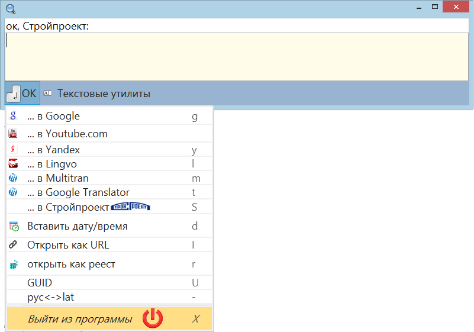
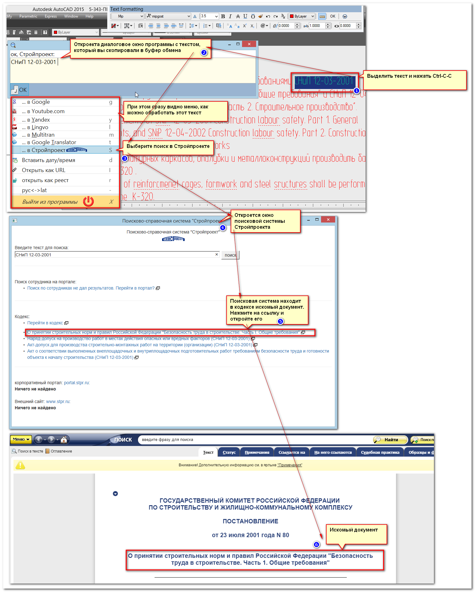
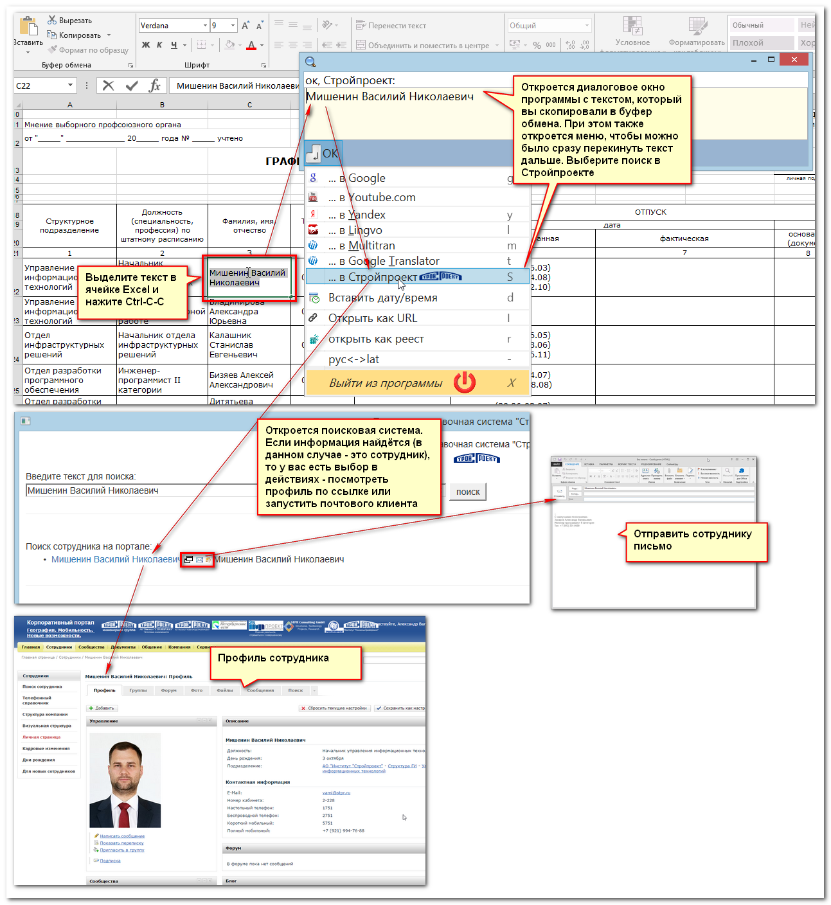
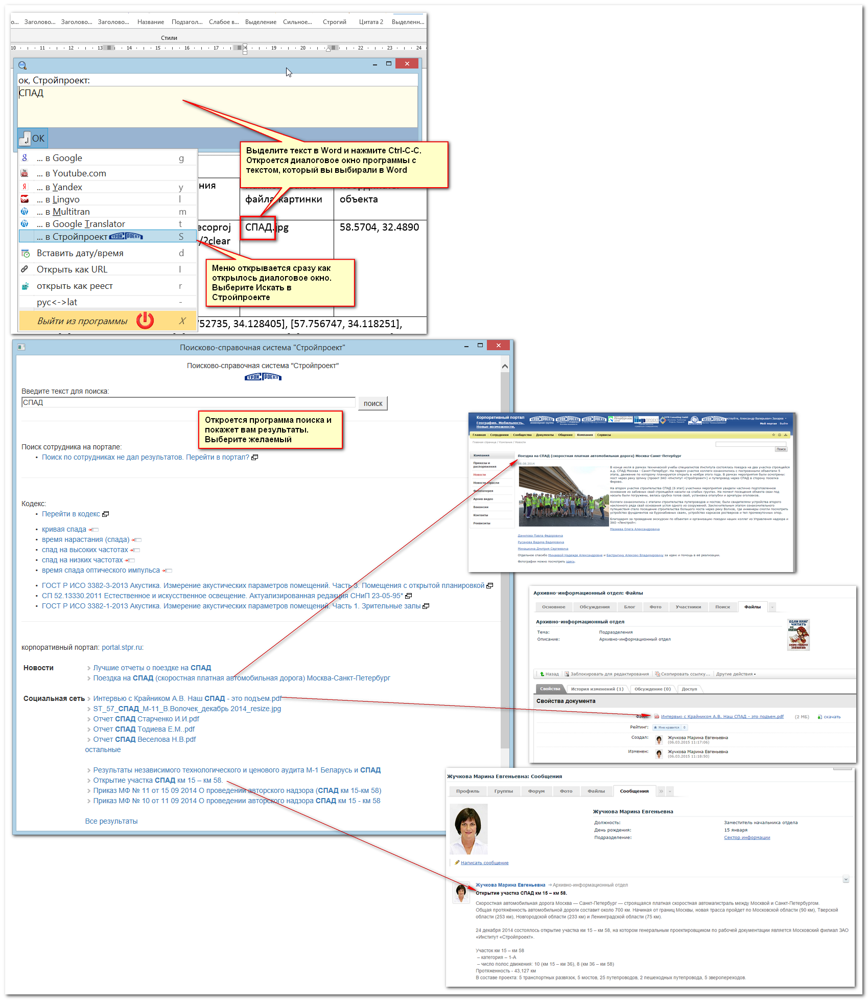
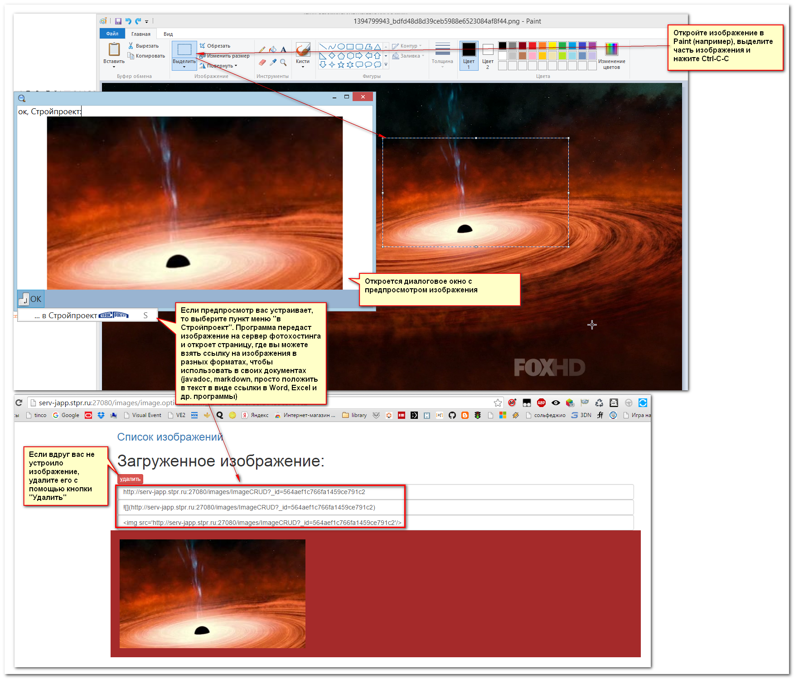
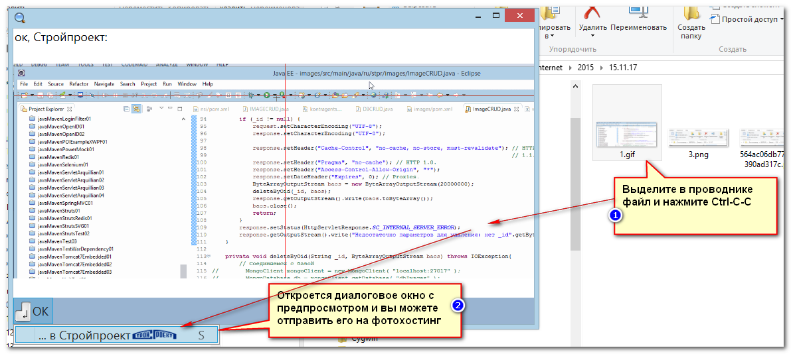
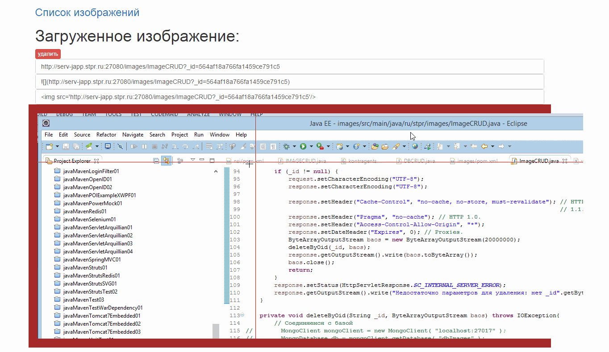
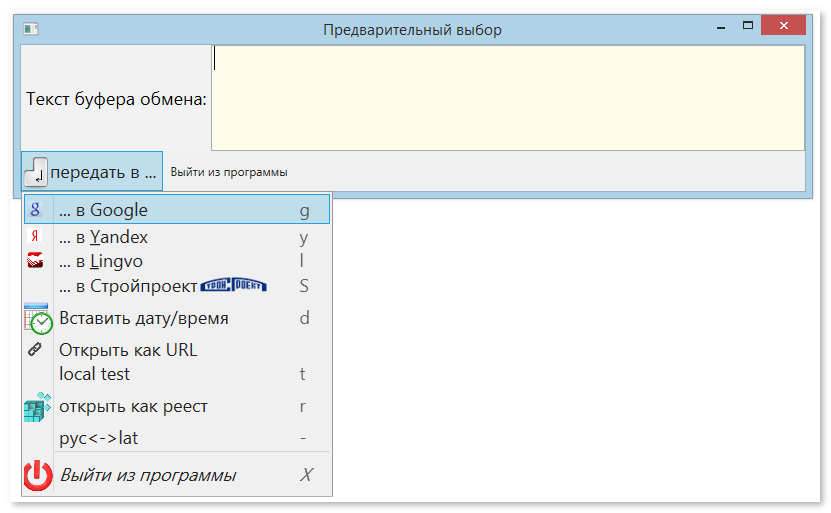
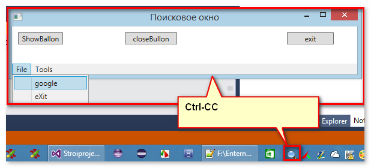
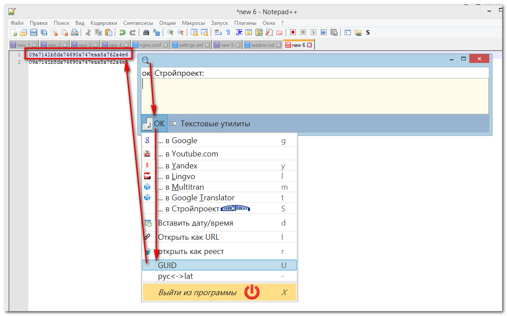

# Проект для упрощения пользованием существующих программных сервисов Стройпроекта.

Приложение имеет два диалоговых окна - для ввода текста и передачи на фотохостинг изображения:

И функционал мониторинга за изменениями в указанных каталогах и дисках. Последние 5 файлов выводятся в контекстом меню:

**Внимание**

В настоящей момент в программе не предусмотрено никакой аутентификации, поэтому выкладывание графических файлов на фотохостинг пока не гарантирует их сохранность, т.к.
любой может стереть любое изображение.

## Поиск.
Для запуска функции поиска выделите какой-либо текст (в любом текстовом редакторе), например:

### Поиск из Автокада:

### Поиск из Excel:

### Поиск из Word:

## Использование фотохостинга.

### Отправка через буфер обмена.

Для отправки изображения на фотохостинг выделите в графическом редакторе область, колторую вы хотите отправить на фотохостинг и так же нажмите Ctrl-C-C.

### Отправка копированием файла

Если вы хотите отправить на фотохостинг графический файл, то это так же можно сделать двойным нажатием Ctr-C-C на имени файла:

**Обратите внимание, что на фотохостинг можно отправлять анимированные gif:**

Например, этот анимированный GIF сделан в бесплатной программе LICECap: http://www.cockos.com/licecap/ (Эта программа хороша тем, что очень хорошо сжимает графику во время записи и 
поэтому не сильно расходует память во время записи).

## Использование наблюдения за файлами.

Для наблюдения за файлами необходимо указать параметры наблюдения. Параметры наблюдения указываются в файле Stroiproject.ini, который будет автоматически создаваться в каталоге, где находится .exe-файл.

Содержимое файла:

1. Каталоги, за которыми надо наблюдать 
2. Расширения, за которыми надо наблюдать (остальные игнорируются).
3. Каталоги-исключения, содержимое которых которые игнорируется.

Указать каталоги для наблюдения можно и в командной строке:

Для дисков нужно указывать две дроби (не знаю в чём причина). Содержимое параметров командной строки и настроек в ini-файле суммируется, дубликаты каталогов для наблюдения удаляются.

Приложение производит слежение за всеми файлами, находящиеся в указанных директориях, но выводит их через "фильтр", чтобы не перегружать вывод на экран. Список файлов см. в проекте

## Примеры действий с наблюдателем

### Сохранение вложения из outlook

### Сохранения картинки из письма outlook

### Сохранения документа word

## Дополнительные ссылки

Проект чтения файлов иконок для файлов по расширению зарегистрированному в операционной системе: http://www.codeproject.com/Articles/29137/Get-Registered-File-Types-and-Their-Associated-Ico
Эти иконки потом используются в пунктах меню, которые указывают на файлы.

## Описание

Перенос проекта http://serv-japp.stpr.ru:7080/stroiproject/stroiproject.git на WPF

2015.04.22

Необходимость переноса возникла в связи с невозможностью управления всплывающими сообщениями в трее. Нашёл неплохой компоненте NotifyIcon (http://www.codeproject.com/Articles/36468/WPF-NotifyIcon)
который оказался написанным на WPF. Кроме того, возникла потребность собирать приложение в один файл. Поэтому решил объединить эти две задачи в одну и сделал это проект.

## Для разработчиков:

Удобнее всего запустить локальный http сервер. Самый простой: 

npm install http-server -g

http-server -p 9081 F:\Enternet\2015\15.04.15\2\interactive-map-stpr-ru

При необходимости целевой каталог заменить. Это проще, чем настраивать nginx.

2015-04-23 11:50:40
- Нужно разобраться как убрать анимацию при открытии формы
- Как открывать кастомизированные меню в трее

2015-04-22 17:36:58

Почти всё реализовано. Интерфейс выглядит так:

Осталось реализовать команды и можно будет работать над всплывающими сообщениями в трее.

2015.04.22

+ Сделана простая форма WPF
+ Перехват нажатия клавиатура Ctrl-CC с помощью классов WPF, а не Windows.form

2016-04-12 14:46:26

+ Добавлена функция вставки GUID с копирование её в буфер обмена. Все лишние знаки кроме цифр удаляются, чтобы можно было выделить всю 
строку двойным нажатием во всех редакторах.

