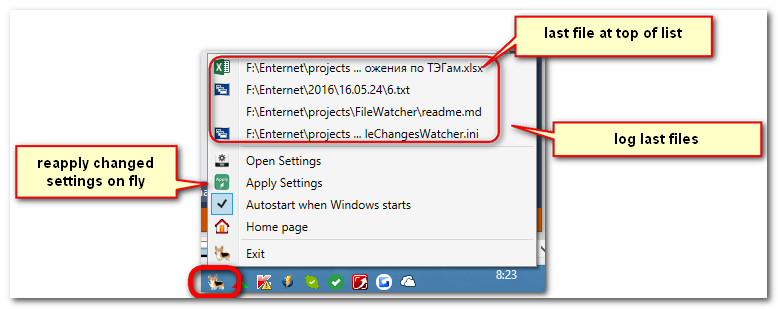
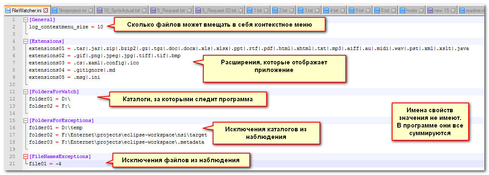
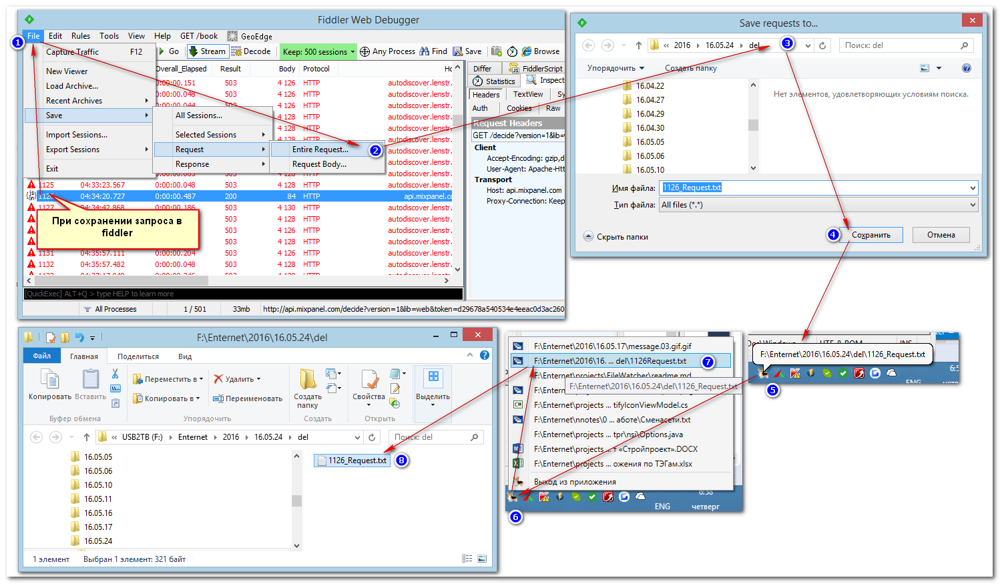
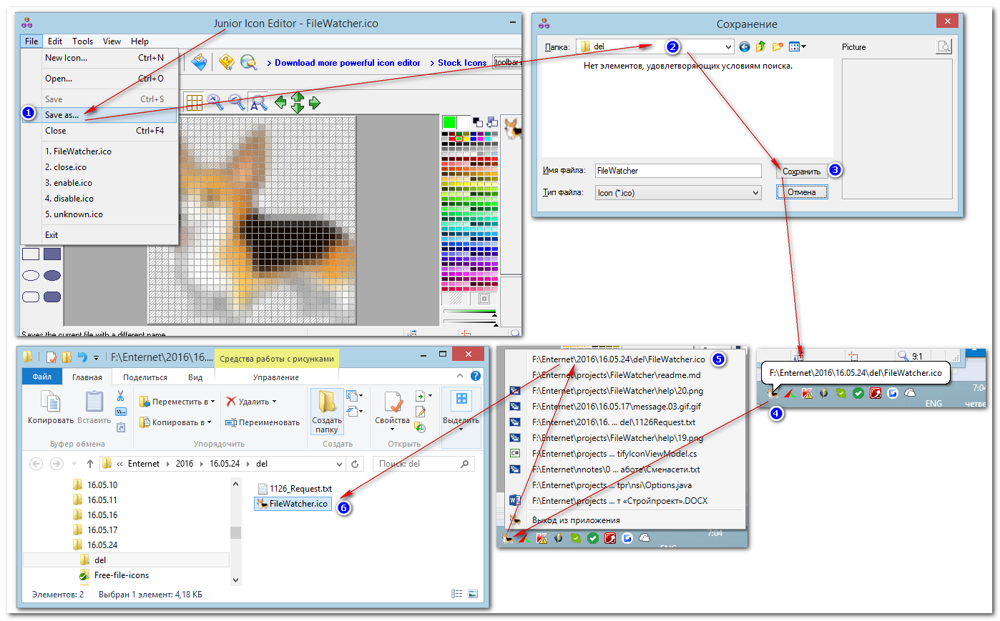
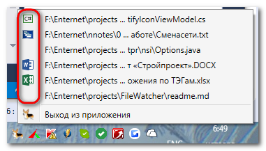

# Проект для мониторинга за изменениями в файлах.

Мониторинг за изменениями в указанных каталогах и дисках. Последние несколько файлов выводятся в контекстом меню (количество настраивается в параметрах файла .ini):

## Использование наблюдения за файлами.

Для наблюдения за файлами необходимо указать параметры наблюдения. Параметры наблюдения указываются в файле Stroiproject.ini, который будет автоматически создаваться в каталоге, где находится .exe-файл.

Содержимое файла:

1. Каталоги, за которыми надо наблюдать 
2. Расширения, за которыми надо наблюдать (остальные игнорируются).
3. Каталоги-исключения, содержимое которых которые игнорируется.

Указать каталоги для наблюдения можно и в командной строке:

Для дисков нужно указывать две дроби (не знаю в чём причина). Содержимое параметров командной строки и настроек в ini-файле суммируется, дубликаты каталогов для наблюдения удаляются.

Приложение производит слежение за всеми файлами, находящиеся в указанных директориях, но выводит их через "фильтр", чтобы не перегружать вывод на экран. Список файлов см. в проекте

## Примеры действий с наблюдателем

### Сохранение вложения из outlook

### Сохранение картинки из письма outlook

### Сохранение документа word

### Сохранение запроса в fiddler

### Сохранение файла иконки в редакторе иконок

## Дополнительные ссылки

Проект чтения файлов иконок для файлов по расширению зарегистрированному в операционной системе: http://www.codeproject.com/Articles/29137/Get-Registered-File-Types-and-Their-Associated-Ico

Эти иконки потом используются в пунктах меню, которые указывают на файлы:

