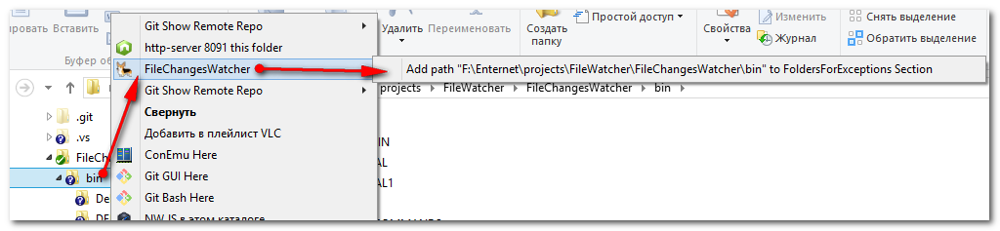
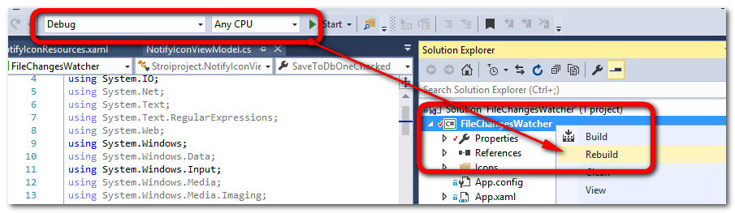

# FileChangesWatcher

## Введение

По поводу отслеживания удаления файла: http://stackoverflow.com/questions/7861512/get-username-of-an-accesed-file?answertab=votes#tab-top
Действительно - без аудита системного журнала, где пишутся события удаления - не обойтись. Для правильной настройки аудита см.: https://gallery.technet.microsoft.com/scriptcenter/How-to-audit-changed-39afba72
http://www.intelliadmin.com/index.php/2008/03/use-auditing-to-track-who-deleted-your-files/

Приложение, которое следит за изменениями в указанных дисках/каталогах и на лету формирует список файлов и каталогов в которых произошли изменения.

## Можно ли отследить процесс, который изменил файл?

Коротко - НЕТ.

http://ebanshi.cc/questions/4262160/is-it-possible-to-identify-what-process-is-changing-a-file-with-filesystemwatche

## Примеры работы приложения.

Редактор иконок редактирует файл:

Слежение за файлом Excel:

Каждый файл в логе имеет такой же значек как и в проводнике windows explorer:

## Описание приложения

Перед началом работы приложение определяет свои настройки из файла **FileChangesWatcher.ini** и определяет настройки:

1. Какие диски и каталоги надо мониторить?
2. Какие файлы по расширению надо мониторить?
3. Какие каталоги надо исключить из миниторинга?
4. Какие файлы (по началу имени) нужно пропускать?

### Описание параметров приложения

Параметры приложения можно открыть с помощью приложения:

При этом запуститься редактор файлов ini по-умолчанию (обычно блокнот).

Параметры для настройки **п.1** указываются в секции [FoldersForWatch]:

Обратите внимание, что ключи должны разными, и в одном ключе нельзя указывать больше одного каталога (это не регулярное выражение).
Имена ключей значения не имеют. Эти значения можно заносить вручную. При старте программа создаёт отдельный watcher для каждого каталога/диска
за которым она будет наблюдать. Но создаёт только для тех каталов, которые присутствуют на диске. Список каталогов, за которыми программа будет наблюдать
выдаётся после запуска программы:

Параметры для настройки **п.2** указываются в серсии [Extensions]:

Имена ключей должны быть разными. Однако в отличии от каталогов в одном ключе в этом разделе может быть указано несколько расширений. Разделителем у них является
символ вертикальной верты **"|"**. Расширения файлов приложение преобразует в регулярное выражение, суммируя ключи. В результате получается шаблон 
**^.*(\.ext1|\.ext2|...|\.ext3)$**. Имена ключей значения не имеют. Можно давать им осмысленные имена, чтобы понимать о каком пакете программ идёт речь.

Параметры для настройки **п.3** указываются в секции [FoldersForExceptions]

Каждому ключу соответствует один каталог. Соответственно в одном ключе нельзя указать больше одного каталога. Когда операционная система
уведомляет программу, что обнаружено изменение, то FileChangesWatcher сначала проверяет, а не случилось ли изменение в каталоге, который
является исключением? Если да, то FileChangesWatcher игнорирует изменение. Имена каталогов-исключений не сравниваются просто как начало строк,
а проверяется, чтобы последние имена отличались и не принадлежали тому каталогу, который просто начинается на похожее имя. Например:

если настройка **folder6 = F:\Enternet\2016\16.05.24\del.01**, то каталог **F:\Enternet\2016\16.05.24\del.01\test** будет исключаться из наблюдения. 
Однако каталог **F:\Enternet\2016\16.05.24\del.01-копия** не будет исключаться из наблюдения, т.к. по сути он не является подкаталогом параметра folder6,
а просто находится с ним в одном каталоге.

Параметры **п.4** хранятся в секции [FileNamesExceptions]

Эти параметры также перечисляются по-одиночке и не являются регулярными выражениями. Эти значения сравниваются только как начала строк имён файлов. Например,
**file01 = ~$** даст положительный ответ на файл **F:\docs\ ~$Договор.docx** (временный файл office).

### Описание меню управления приложением.

## Работа с контекстным меню приложения

Чтобы работать с контекстным меню приложения надо это меню зарегистрировать с помощью меню управления приложением (Требуются права локального администратора):

После регистрации в контекстном меню проводника Windows explorer появится меню FileChangesWatcher с подменю:

В контекстном меню на левой панели (Добавить каталог в секцию [FoldersForExceptions]):

В контекстно меню каталога на правой панели (Добавить каталог в секцию [FoldersForExceptions])

В контекстном меню на файлах (Добавить расширение файла в секцию [Extensions])

Это позволяет упростить добавление соответствующих элементов в разделы настройки программы:

После добавления нужно заново применить настройки (чтобы не перезагружать программу):

Для отмены контестного меню проводника выберите пункт (UnRegister Windows Explorer Context menu) (Так же требуются права локального администратора):

## Для разработчика

Для сборки проекта необходимо иметь доступ к Интернет, чтобы иметь возможность загрузить сторонние компоненты приложения.

### Запуск приложения на отладку в режиме контекстного меню проводника

Первый способ отладки приложения в таком режиме можно выполнить с помощью инструмента SharpShellTools. Хорошее описание: http://www.codeproject.com/Articles/512956/NET-Shell-Extensions-Shell-Context-Menus

Инструмент Server Manager, который описан в документе, ищите в каталоге, куда установлен компонент SharpShellTools:

Второй способ отладки - выполнить подсоединение к процессу Explorer в Visual Studio:

- После сборки запустить приложение как .exe под администратором и выполнить регистрацию компонента:

В Visual Studio открыть диалоговое окно подсоединения к процессу:

Выбрать/открыть Windows Explorer в котором будем тестировать компонент:

Выполнить попытку вызова контекстного меню:

До вызова контекстного меню вы должны получить переход в отладку и попасть в точку останова:

### Сборка приложения после Register/Unregister компонента

После вызова функций приложения в проводнике файл FileChangesWatcher.exe оказывается заблокирован на запись и выполнить сборку приложения нельзя:

Дело в том, что после запуска контекстного меню файл FileChangesWatcher.exe заблокирован windows explorer. Чтобы разблокировать этот файл нужно закрыть все
экземпляры windows explorer:

Но при этом среди процессов они всё-таки остаются и их там так же надо закрыть:

Повторяем сборку:

Сборка выполнилась успешно. Снова запустим проводник:

(Возможно, что именно по этой причине требуется перезагружать компьютер после uninstall приложений)

## RegisterAssembly

Обратить внимание на следующую особенность работы функции RegisterAssembly:

Чтобы приложение нормально регистрировалось в windows explorer на платформах x64 обязательно нужно ОТКЛЮЧИТЬ настройку "prefer 32-bit":

Если этого не сделать, то функция будет возвращать успешную регистрацию, однако по факту никакого подменю не появится.

## Настройка аудита для генерации событий удаления файлов и каталогов:

Включить систему аудита файлов (минимальная настройка для регистрации успешных событий):

run **secpol.msc**

Настроить аудит файлов и каталогов, за которыми требуется установить наблюдение:

После этого в журнале событий начнут появляться сообщения:

Вот их программа и будет анализировать.

## Дополнительные материалы по теме.

Аудит удаления и доступа к файлам и запись событий в лог-файл средствами Powershell: https://habrahabr.ru/post/150149/

Как открыть WPF WebBrowser страницу не по ссылке, а по содержимому: http://stackoverflow.com/questions/1598030/set-system-windows-controls-webbrowsers-content-to-a-static-html-literal?answertab=votes#tab-top

C шарп.  Проверка существования элемента в коллекции по его значению: https://msdn.microsoft.com/ru-ru/library/bfed8bca%28v=vs.110%29.aspx?f=255&MSPPError=-2147217396

Windows. Настройка политики безопасности Windows 10 Home Edition: http://winitpro.ru/index.php/2015/10/02/redaktor-gruppovyx-politik-dlya-windows-10-home-edition/

